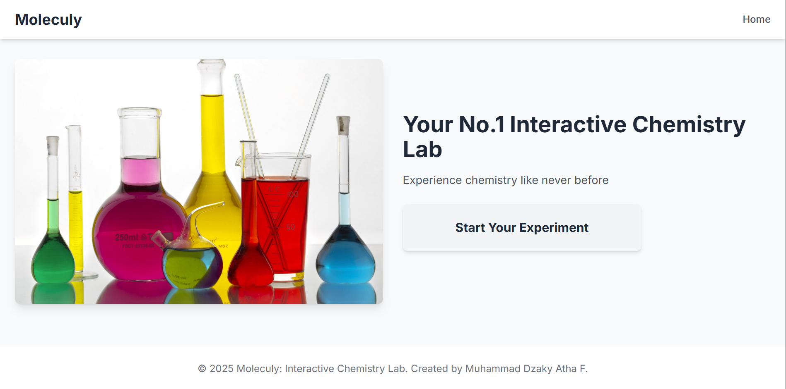

# 🧪Moleculy: Interactive Virtual Chemistry Lab

**Moleculy** is an interactive web-based simulated chemistry laboratory that allows user to experiment with chemical reactions in a safe virtual environment.

## 🌟 Key Features

- **Drag & Drop Interface**: Intuitive drag-and-drop system for mixing chemicals
- **Real-time Visual Effects**: Watch chemicals react with realistic animations
- **11 Different Reactions**: Discover various chemical combinations
- **Real Chemical Formulas**: See actual chemical equations for reactions

## 🛠️ Tech Stack

- HTML
- Tailwind CSS
- VanillaJS

Happy Experimenting! 🧪✨